# Godot Debug Draw

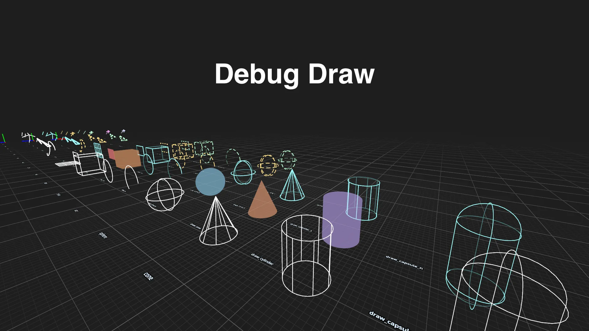

Reusable in-scene 3D debug drawing for Godot 4.7.

`DebugDraw3D` submits transient draw commands each frame and renders wire shapes, dashed and normal-aware lines, joints, filled rects, and solid primitives with `MultiMeshInstance3D` nodes and shaders.

## Features

- Lines, rays, arrows, axes, point collections, curves, and grids.
- Wire and solid rects, boxes, spheres, cones, cylinders, and capsules.
- Dashed lines, normal-aware fading, round/bevel/miter joints, and layer filtering.
- Screen-space line widths and configurable depth bias.
- Curated example scenes for every public shape family.
- No external runtime dependencies.

## Screenshots

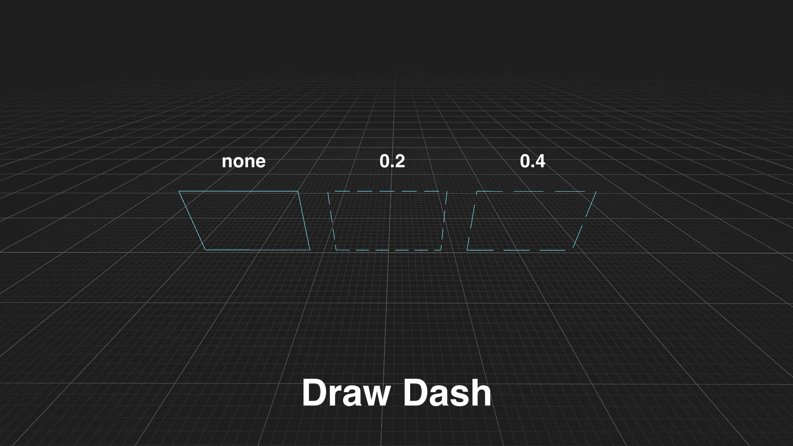

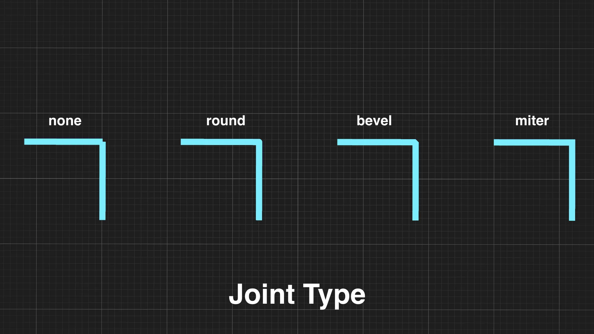

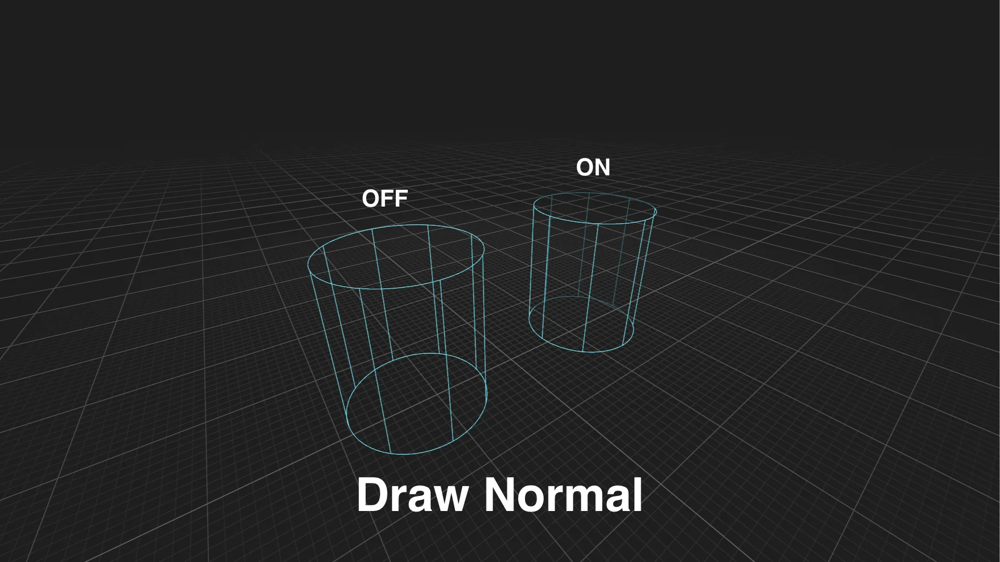

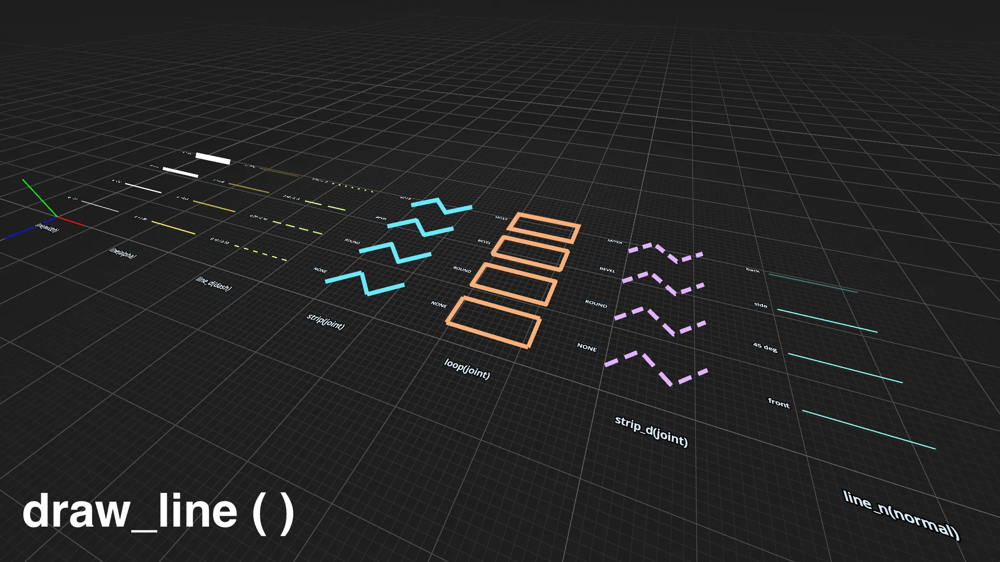

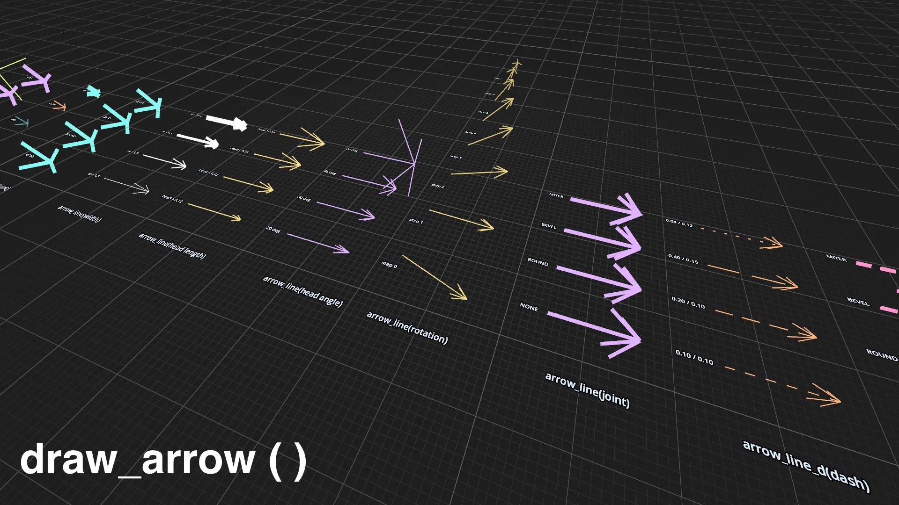

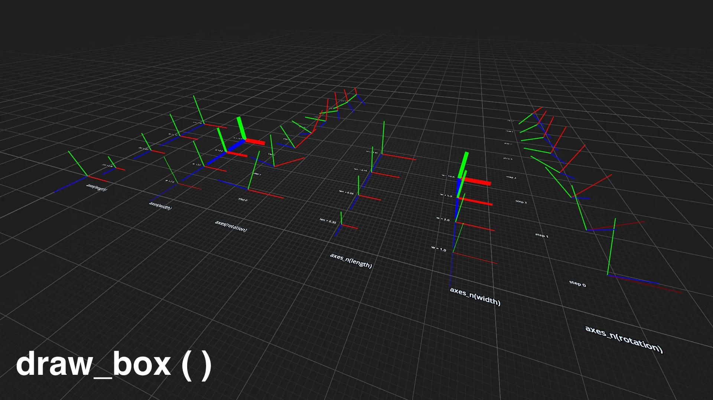

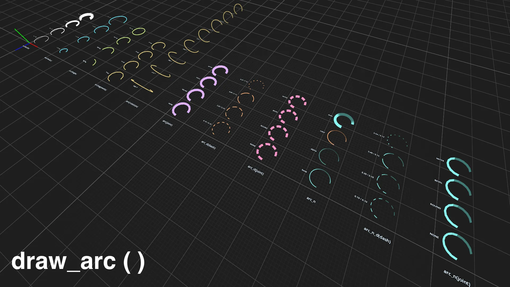

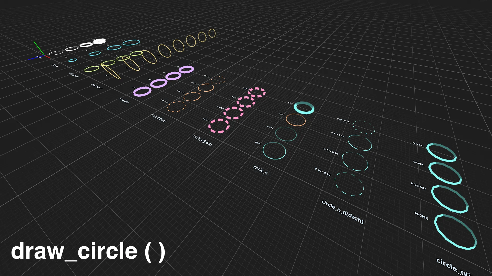

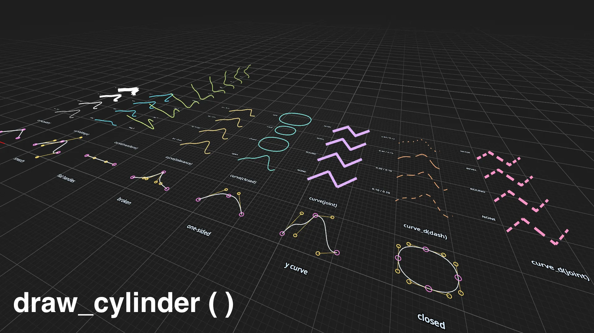

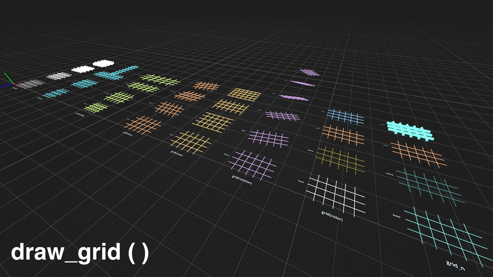

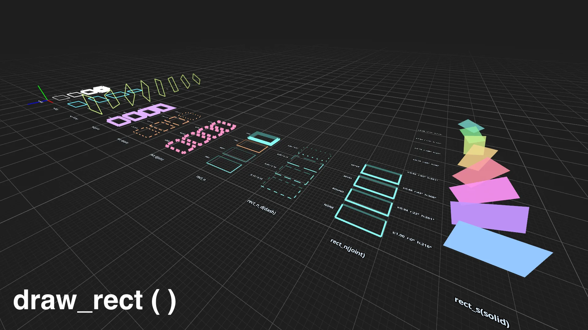

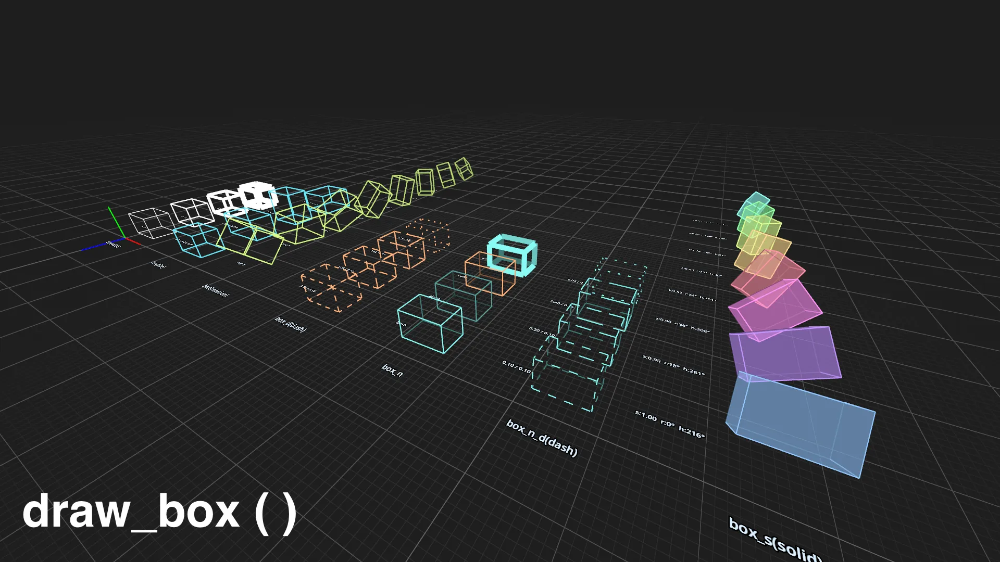

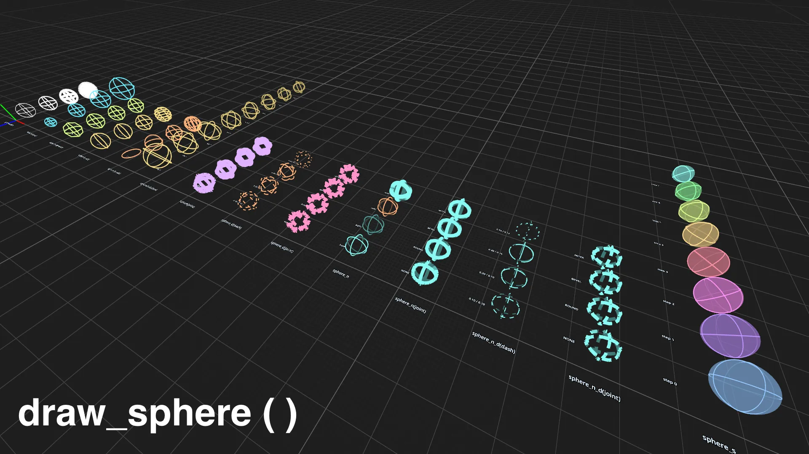

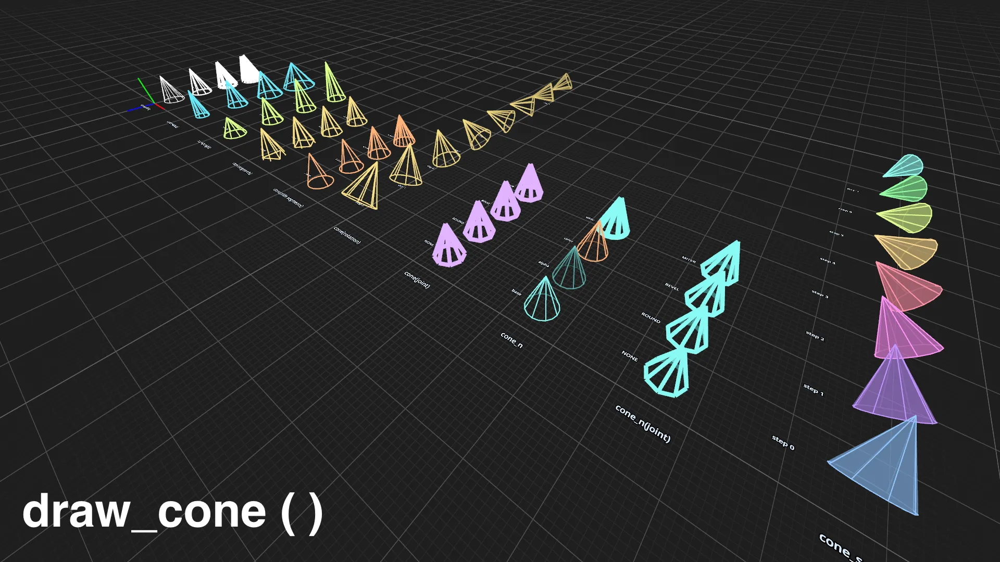

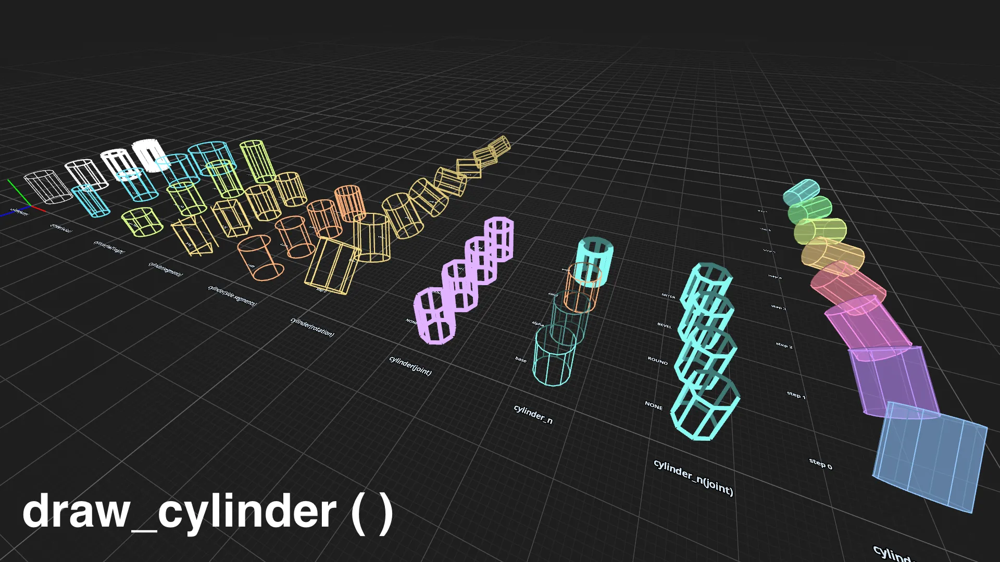

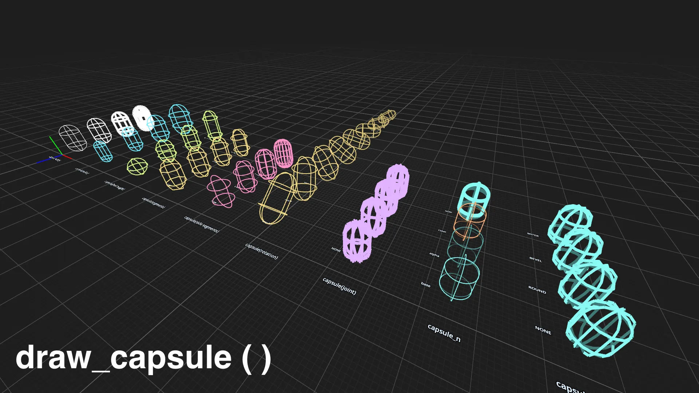

## Installation

Copy [`addons/debug_draw/`](addons/debug_draw/) into your Godot project:

```text
res://addons/debug_draw/
```

No plugin activation is required. Instance `res://addons/debug_draw/debug_draw_3d.tscn` in a 3D scene.

```gdscript
@onready var debug_draw: DebugDraw3D = $DebugDraw3D

func _process(_delta: float) -> void:
  debug_draw.draw_line(Vector3.ZERO, Vector3.RIGHT, Color.WHITE, 2.0)
```

## Documentation

- [`docs/getting-started.md`](docs/getting-started.md): add `DebugDraw3D`, submit transient draw calls, and configure common node controls.
- [`docs/concepts.md`](docs/concepts.md): draw-call lifetime, world-space transforms, widths, layers, suffixes, dashes, normal-aware drawing, and joints.
- [`docs/api-reference.md`](docs/api-reference.md): public `DebugDraw3D` API grouped by lines, helpers, collections, grids, rects, and volumes.
- [`docs/examples.md`](docs/examples.md): example-scene families, camera controls, shared conventions, and API coverage.
- [`docs/rendering-architecture.md`](docs/rendering-architecture.md): MultiMesh renderers, shaders, frame pipeline, sorting, depth bias, and constraints.

## Examples

`examples/` contains the API index and curated scenes for each supported shape family. Run the project to open `examples/index.tscn`.

## Development

```bash
just init
just test              # Run gdUnit4 tests if gdUnit4 is installed
just fmt               # Format project GDScript
just lint              # Lint project GDScript
just check             # Run formatting and lint checks
just changelog         # Generate CHANGELOG.md with cocogitto
just release v1.0.0    # Create an annotated tag, addon ZIP, and GitHub Release
```

## Project Structure

```text
addons/
  debug_draw/
    renderers/
    shaders/
    debug_draw_3d.tscn
    debug_draw_3d.gd
docs/
examples/
entities/
project.godot
```

## License

MIT License. See [LICENSE](LICENSE).
